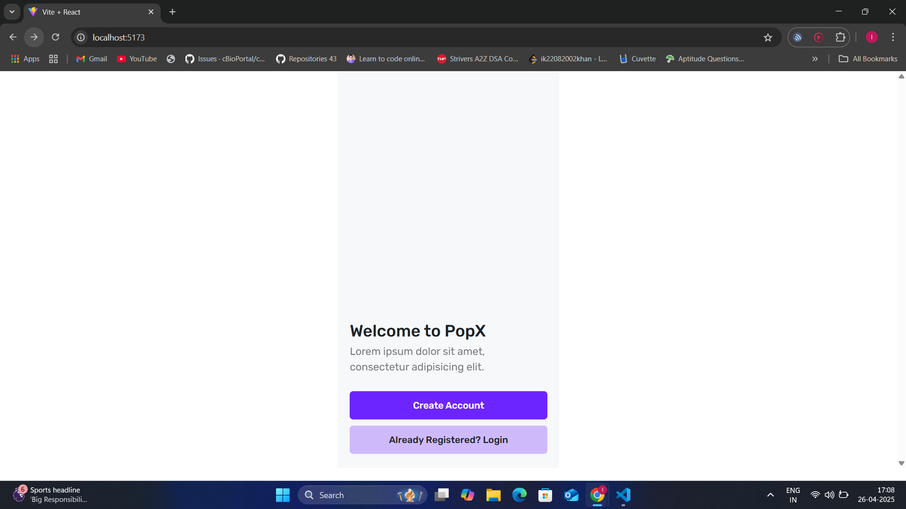
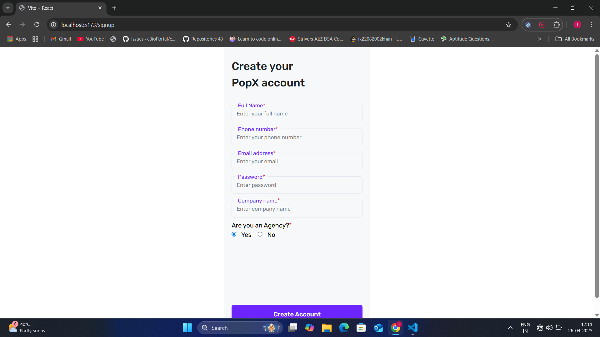
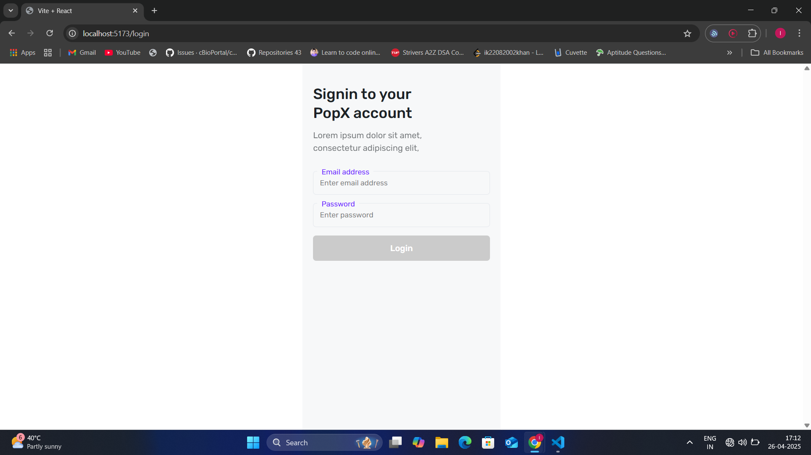
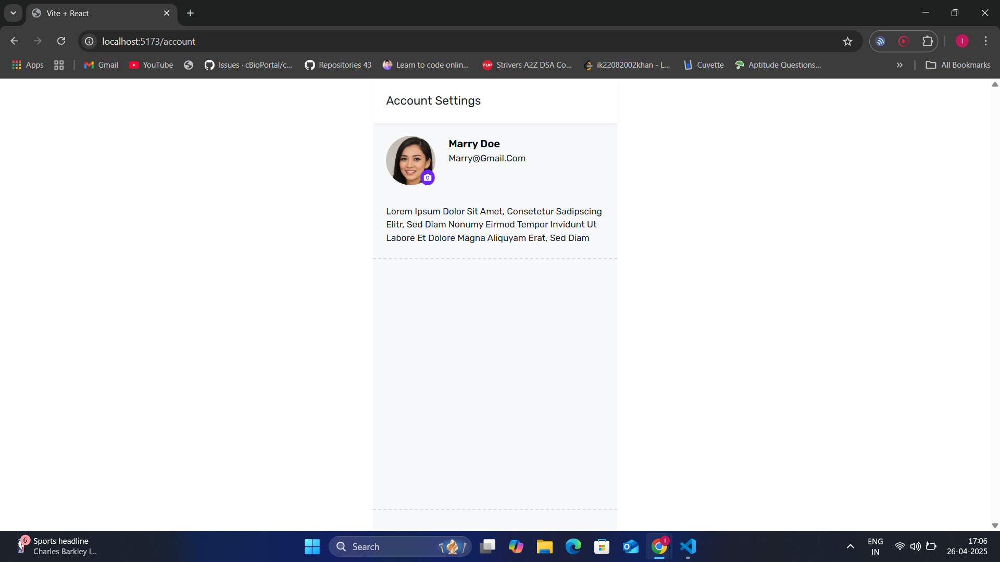

# Internship Project

This is a modern and responsive web application built using React.js, Vite, and Tailwind CSS.

---
## Preview

Live at : -https://educase-india-test.vercel.app/

 Home.jsx



SignUp.jsx



Login.jsx



Account.jsx 


---

## Features

- Built with React.js and Vite for fast performance.
- Tailwind CSS for utility-first, responsive UI design.
- 'Rubik' font-family used globally for consistent styling.
- Clean, organized, and scalable folder structure.

---

## Tech Stack

- React.js
- Vite
- Tailwind CSS

---

## Setup Instructions

Follow the steps below to set up and run the project locally:

### 1. Clone the Repository

#### Open your terminal and run:

```bash
git clone https://github.com/your-username/your-repository.git
```
#### Navigate to the Project Directory

```bash 
cd your-repository
```

#### Install Dependencies
Make sure you have Node.js and npm installed. 

Then install all required packages:

```bash 
npm install
```
 #### Start the Development Server

 ``` bash
 npm run dev
 ```
By default, the project will run at:

```bash 
http://localhost:5173/
```

Happy coding :)
